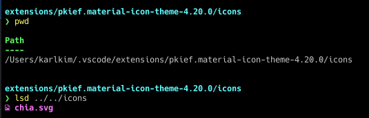
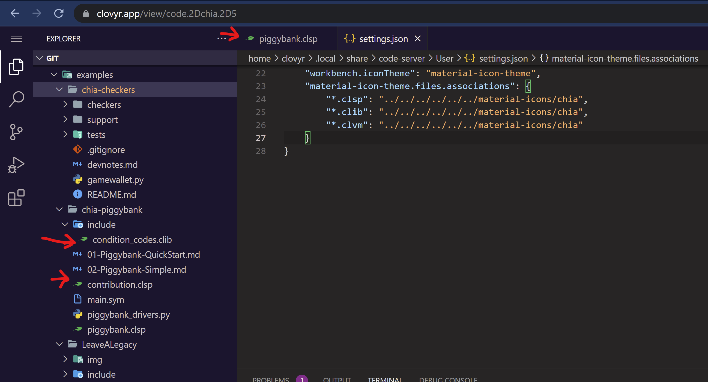

## develop chia-network/chia-blockchain
```sh
# bash
$ pwd
/Users/karlkim/kimsk/chia-blockchain
$ python -m venv venv
$ . ./activate
(venv) $ pip -V
pip 22.2.2 from /Users/karlkim/kimsk/chia-blockchain/venv/lib/python3.10/site-packages/pip (python 3.10)
(venv) $ pip list
Package    Version
---------- -------
pip        22.2.2
setuptools 65.4.1
(venv) $ pip install ".[dev]"
Processing /Users/karlkim/kimsk/chia-blockchain
  Installing build dependencies ... done
  Getting requirements to build wheel ... done
  Preparing metadata (pyproject.toml) ... done
Collecting blspy==1.0.15
  Using cached blspy-1.0.15-cp310-cp310-macosx_11_0_arm64.whl (629 kB)

...

# powershell
chia-blockchain on  chia-keys-show-json [!] via 🐍 v3.10.8 (venv)
❯ pip list | grep black
black                     22.8.0

chia-blockchain on  chia-keys-show-json [!] via 🐍 v3.10.8 (venv)
❯ pip list | grep pytest
pytest                    7.1.3
pytest-asyncio            0.19.0
pytest-cov                4.0.0
pytest-forked             1.4.0
pytest-xdist              2.5.0

chia-blockchain on  chia-keys-show-json [!] via 🐍 v3.10.8 (venv)
❯ pytest -sv -n 0 tests/core/cmds/test_keys.py -k test_show_json
========================================================= test session starts =========================================================
platform darwin -- Python 3.10.8, pytest-7.1.3, pluggy-1.0.0 -- /Users/karlkim/kimsk/chia-blockchain/venv/bin/python
cachedir: .pytest_cache
rootdir: /Users/karlkim/kimsk/chia-blockchain, configfile: pytest.ini
plugins: xdist-2.5.0, forked-1.4.0, asyncio-0.19.0, cov-4.0.0
asyncio: mode=strict
collected 40 items / 39 deselected / 1 selected

tests/core/cmds/test_keys.py::TestKeysCommands::test_show_json PASSED

================================================== 1 passed, 39 deselected in 0.15s ===================================================
```

## Customize Chia Icon File

1. Install [Material Icon Theme](https://marketplace.visualstudio.com/items?itemName=PKief.material-icon-theme)
2. Download Chia file icon

```sh
❯ curl https://raw.githubusercontent.com/kimsk/chia-settings/main/images/chia.svg -o chia.svg
```
> This is a smaller version of a file you find in https://github.com/Chia-Network/chia-dev-guides/blob/main/static/img/chia_leaf_green.svg

3. Update User Settings and point to the file location (relative to material-icon-theme extension `icons` folder)


```json
"workbench.iconTheme": "material-icon-theme",
"material-icon-theme.files.associations": {
    "*.clsp": "../../icons/chia",
    "*.clib": "../../icons/chia",
    "*.clvm": "../../icons/chia",
    "*.clinc": "../../icons/chia"
},
```
4. Material Icon Screenshot
