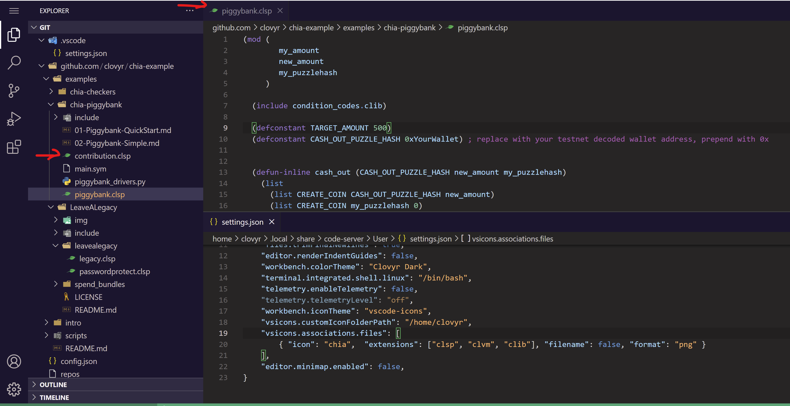

## Install vsicons extension
1. Install `vscode-icons` extension
2. `ctrl-shift-p` and type `reload window`
3. Select `Developer: Reload Window` to reload VS Code

## Download Chia file icon via Terminal
 
```sh
clovyr@code:~/git$ cd ~
clovyr@code:~$ mkdir vsicons-custom-icons
clovyr@code:~$ cd vsicons-custom-icons/
clovyr@code:~/vsicons-custom-icons$ wget -q https://raw.githubusercontent.com/kimsk/chia-settings/main/images/file_type_chia.png
clovyr@code:~/vsicons-custom-icons$ ls -l
total 12
-rw-r--r-- 1 clovyr clovyr 8309 Feb  2 16:30 file_type_chia.png
```

## Update settings
1. `ctrl-shift-p` and type `settings json`
2. Select `Preferences: Open Settings (JSON)`
3. Add the following lines to `settings.json`

```json
"workbench.iconTheme": "vscode-icons",
"vsicons.customIconFolderPath": "/home/clovyr",
"vsicons.associations.files": [
    { "icon": "chia",  "extensions": ["clsp", "clvm", "clib"], "filename": false, "format": "png" } 
],
```
4. `ctrl-shift-p` and type `Apply Icons`
5. Select `Icons: Apply Icons Customization`

## Final
Sometime it takes a while for VS Code to update icon file. But if everything works well, you should see the **chia** icon like the screenshot below:

